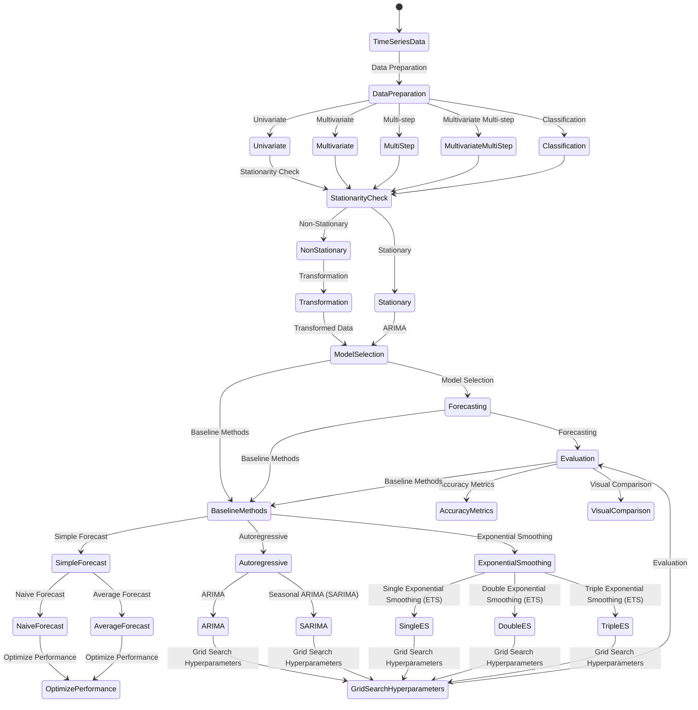

  <h1 align=center>ML_Deploy_Time_Series-Product-Sales-Project</h1>
  

<h2>Time Series Forecasting Basics</h2>

<strong>Definition:</strong> Time series forecasting is the process of predicting future values based on historical patterns and trends in sequential data.

<h3>Forecasting Problems</h3>

We will work through 5 different types of time series forecasting problems:

<ol>
  <li>Univariate: A single series of observations over time.</li>
  <li>Multivariate: Multiple inter-related observations over time.</li>
  <li>Multi-step: Forecast multiple time steps into the future.</li>
  <li>Multivariate Multi-step: Forecast multiple time steps into the future for multiple different series.</li>
  <li>Classification: Predict a discrete class given a sequence of observations over time.</li>
</ol>
<h3>Baseline Methods</h3>

We will discover 3 methods that you can use to develop robust baselines for your time series forecasting problems:

<ol>
  <li>Simple forecast methods: Methods such as naive or persistence forecasting and averaging methods, as well as how to optimize their performance.</li>
  <li>Autoregressive forecasting methods: Methods such as ARIMA and Seasonal ARIMA (SARIMA) and how to grid search their hyperparameters.</li>
  <li>Exponential smoothing forecasting methods: Methods such single, double and triple exponential smoothing also called ETS and how to grid search their hyperparameters.</li>
</ol>

Below steps provide a general framework, and the specific implementation may vary depending on the deep learning library or framework you are using. It's also essential to keep in mind the specific characteristics and requirements of your time series data when applying these steps.

<h3>1. Data Preparation:</h3>

This step involves gathering and cleaning your time series data. Ensure that your data is in a tabular format with a single column representing the target variable (output) and additional columns representing the input features. If you have a univariate time series, you need to create lagged versions of the variable to use as input features.

<ul>
  <li>Trend: Analyze the overall trend in the data (e.g., increasing, decreasing, or stationary). Use methods like trend decomposition or moving averages to identify and remove trends.</li>
  <li>Seasonality: Identify any repeating patterns or seasonal fluctuations in the data. Techniques like seasonal decomposition of time series (e.g., using STL decomposition) or Fourier transforms can help in detecting and extracting seasonal components.</li>
  <li>Stationarity: Check if the data is stationary (constant mean and variance) or requires transformation. Stationarity is essential for many time series models. Techniques like differencing or logarithmic transformation can be applied to achieve stationarity.</li>
</ul>

<h3>2. Normalization:</h3>

Normalize your input features to a similar scale. Deep learning models often benefit from scaled data, as it helps in faster convergence and better model performance. Common scaling techniques include min-max scaling or standardization.

<h3>3. Train-Test Split:</h3>

Split your dataset into training and testing subsets. Typically, you reserve a portion of the data (e.g., the most recent observations) for testing the model's performance. The remaining data will be used for training the model.

<h3>4. Reshaping:</h3>

Deep learning models expect input data in a specific shape, typically a three-dimensional structure of samples, timesteps, and features. Reshape your input data accordingly. For example, if you have N samples, T timesteps, and F features, your input shape would be (N, T, F).

<h3>5. Model Selection:</h3>
<ul>
  <li>Autoregressive Integrated Moving Average (ARIMA): A widely used model for time series forecasting. ARIMA models incorporate autoregressive (AR), differencing (I), and moving average (MA) components. Suitable for stationary time series with no trend or seasonality.</li>
  <li>Seasonal ARIMA (SARIMA): An extension of ARIMA that incorporates seasonal components in the data. It includes additional seasonal parameters to capture seasonal patterns.</li>
  <li>Exponential Smoothing (ES): Models the trend and seasonality using exponential decay. Various types of exponential smoothing methods, such as Simple Exponential Smoothing (SES), Holt's Linear Exponential Smoothing, or Holt-Winters' Triple Exponential Smoothing, can be employed.</li>
  <li>Prophet: Facebook's open-source library for time series forecasting. Prophet automates the process of forecasting by automatically detecting trend, seasonality, and holiday effects.</li>
  <li>Long Short-Term Memory (LSTM): A type of recurrent neural network that can capture long-term dependencies in the data. LSTM is effective for complex time series patterns and can handle sequences with varying lengths.</li>
</ul>

<h3>6. Model Architecture:</h3>

Design the architecture of your deep learning model. There are various architectures you can explore, such as Multilayer Perceptrons (MLPs), Convolutional Neural Networks (CNNs), Long Short-Term Memory networks (LSTMs), or hybrid models combining different architectures. Choose the architecture that best suits your problem and dataset.

<h3>7. Hyperparameter Tuning:</h3>

Select appropriate hyperparameters for your model. Hyperparameters include the number of layers, units per layer, activation functions, learning rate, batch size, etc. You can use techniques like grid search, random search, or Bayesian optimization to find the optimal combination of hyperparameters.

<h3>8. Model Training:</h3>

Train your deep learning model using the training data. This involves optimizing the model's weights using an optimization algorithm (e.g., stochastic gradient descent) and minimizing a loss function (e.g., mean squared error). Iterate over multiple epochs (passes through the training data) to improve the model's performance.

<h3>9. Model Evaluation:</h3>

Evaluate the trained model's performance on the test dataset. Calculate appropriate evaluation metrics such as mean squared error, mean absolute error, or accuracy, depending on the nature of your forecasting problem.

<ul>
  <li>Train-Test Split: Divide the data into training and testing sets, with earlier data for training and later data for testing.</li>
  <li>Evaluation Metrics: Calculate metrics such as Mean Squared Error (MSE), Mean Absolute Error (MAE), Root Mean Squared Error (RMSE), or Mean Absolute Percentage Error (MAPE) to assess forecast accuracy. Additionally, visual inspection of the forecasted values compared to the actual data can provide insights.</li>
</ul>

<h3>10. Prediction:</h3>

Once you have a trained and evaluated model, you can make predictions on new, unseen data. Prepare the new data in the same format as your training data (including normalization and reshaping) and use the trained model to forecast future values.

<h3>11. Model Refinement:</h3>

Analyze the model's performance and iteratively refine it. This may involve adjusting hyperparameters, trying different architectures, or incorporating additional features. Continuously evaluate and compare the model's performance with different variations to identify the best approach.

### More Info
- https://machinelearningmastery.com/deep-learning-for-time-series-forecasting
