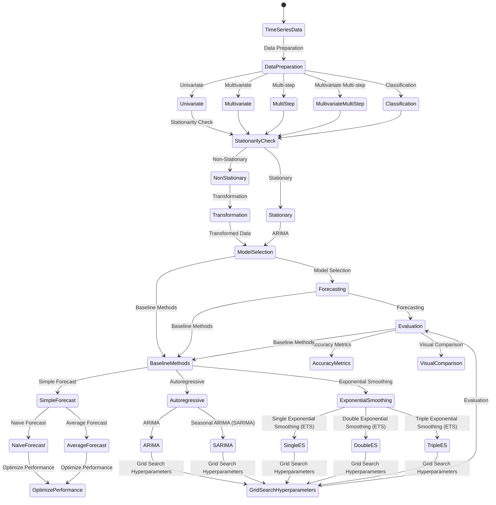

  <h1 align=center>14T-Machine-Learning-Time-Series-Projects-with-Python</h1>
  

<h2>Introduction to Time Series Forecasting</h2>

<strong>Definition:</strong> Time series forecasting is the process of <b>predicting future values</b> based on <b>historical patterns and trends in sequential data</b>.

Time series data often exhibit patterns such as trends and seasonality. A typical time series can be decomposed into the following components: "base level", "trend", "seasonality" (or "cyclic" behavior), and "error".

A trend represents a long-term increasing or decreasing pattern observed in the data. Seasonality refers to a repetitive pattern that occurs at regular intervals, which could be daily, weekly, monthly, or any other fixed time period. By understanding these components, we can develop models to capture and forecast the underlying patterns in the data.

<h3>Forecasting Problems</h3>

We will work through 5 different types of time series forecasting problems:

<ol>
  <li>Univariate: A single series of observations over time.</li>
  <li>Multivariate: Multiple inter-related observations over time.</li>
  <li>Multi-step: Forecast multiple time steps into the future.</li>
  <li>Multivariate Multi-step: Forecast multiple time steps into the future for multiple different series.</li>
  <li>Classification: Predict a discrete class given a sequence of observations over time.</li>
</ol>

<h3>Baseline Methods</h3>

We will discover 3 methods that you can use to develop robust baselines for your time series forecasting problems:

<ol>
  <li>Simple forecast methods: Methods such as naive or persistence forecasting and averaging methods, as well as how to optimize their performance.</li>
  <li>Autoregressive forecasting methods: Methods such as ARIMA and Seasonal ARIMA (SARIMA) and how to grid search their hyperparameters.</li>
  <li>Exponential smoothing forecasting methods: Methods such single, double and triple exponential smoothing also called ETS and how to grid search their hyperparameters.</li>
</ol>

<h3>Additive and multiplicative time series</h3>

Depending on the nature of the trend and seasonality, a time series can be modeled as an additive or multiplicative, wherein, each observation in the series can be expressed as either a sum or a product of the components:

Additive time series:

<ul>
  <li>Value = Base Level + Trend + Seasonality + Error</li>
</ul>

Multiplicative Time Series:

<ul>
  <li>Value = Base Level x Trend x Seasonality x Error</li>
</ul>

<h2>Stationarity Check and Augmented Dickey-Fuller Test</h2>

Stationarity is an important concept in time series analysis. A stationary time series is one whose statistical properties, such as mean and variance, do not change over time. Stationary data is desirable for time series forecasting as it allows for more reliable modeling and prediction.

The Augmented Dickey-Fuller (ADF) test is a statistical test commonly used to determine if a time series is stationary. It examines the presence of unit roots, which are indicative of "non-stationarity". The null hypothesis of the ADF test is that the time series has a unit root, meaning it is "non-stationary". The alternate hypothesis is that the time series is "stationary". 
    

The ADF test evaluates the test statistic (usually denoted as Dickey-Fuller t-statistic) against critical values at different confidence levels. If the test statistic is less than the critical value, we reject the null hypothesis and conclude that the time series is "stationary". Conversely, if the test statistic is greater than the critical value, we fail to reject the null hypothesis and infer that the time series is "non-stationary".

The ADF test takes into account the autoregressive structure of the time series and helps identify the order of differencing required to achieve stationarity. Differencing involves computing the differences between consecutive observations, which can remove trends and make the series stationary.

Here are the steps to perform the ADF test:

<pre><b>Ho : Data is not Stationary   : NULL hypothesies</b></pre>

<pre><b>H1 : Data is Stationary       : alternate hypothesies</b></pre>

<ol>
  <li>In Python, you can use the `statsmodels.tsa.stattools` module.</li>
  <li>Apply the ADF test using the `adfuller()` function on your time series data.</li>
  <li>Retrieve the test statistic and p-value from the test result.</li>
  <li>Interpret the results:
    <ul>
      <li>If the p-value is less than a chosen significance level (e.g., 0.05), reject the null hypothesis and consider the time series "stationary".</li>
      <li>If the p-value is greater than the significance level, fail to reject the null hypothesis, indicating "non-stationarity".</li>
    </ul>
  </li>
  <li>Make necessary adjustments to achieve stationarity. This may involve differencing the data or applying other transformations.</li>
</ol>

By following these steps, you can assess the stationarity of your time series using the Augmented Dickey-Fuller test and take appropriate actions for modeling and forecasting.

<h3>Making data stationary with Differencing</h3>

Differencing is a technique used to make a time series stationary by calculating the differences between consecutive observations. It helps remove trends and other non-stationary components from the data, making it easier to analyze and model. Differencing is a common step in time series analysis and forecasting.

<h2>Time Series Forecasting Basics</h2>

Time series analysis often involves using ARMA (Autoregressive Moving Average) models. The general formula for an ARMA model is:

<pre><b>Yt = c + Σ(AR term ) + Σ(MA term ) + εt</b></pre>

<pre><b>Yt = c + Σ(ϕi * Yt-i) + Σ(θi * εt-i) + εt</b></pre>

Where:

<ul>
  <li>Yt represents the value of the time series at time t.</li>
  <li>c is a constant term or intercept.</li>
  <li>ϕi represents the autoregressive (AR) parameters, which capture the relationship between the current observation and previous observations Yt-i. The index i ranges from 1 to p, where p is the order of the autoregressive component.</li>
  <li>εt is the error term at time t, representing the deviation between the predicted and actual values.</li>
  <li>θi represents the moving average (MA) parameters, which capture the relationship between the error terms εt-i. The index i ranges from 1 to q, where q is the order of the moving average component.</li>
</ul>

<h2>What are AR and MA models?</h2>

ARMA models combine the autoregressive (AR) and moving average (MA) components to describe the dependence between the current observation and previous observations, as well as the dependence between the error terms. The autoregressive component considers the linear relationship between the current observation and a certain number of lagged observations. The moving average component models the linear dependence between the error terms and lagged error terms.

<h2>Introduction to ARIMA(p, d, q) Models</h2>

ARIMA (Autoregressive Integrated Moving Average) models extend the ARMA framework by incorporating differencing to achieve stationarity. Differencing involves subtracting the current observation from a lagged observation to remove the trend or seasonality present in the data. The order of differencing, denoted as d, indicates the number of times differencing is applied to the time series.

<h2>What does the p, d, and q in ARIMA model mean?</h2>

In ARIMA(p, d, q) models:

<ul>
  <li>p represents the order of the autoregressive (AR) component, indicating how many lagged observations are used for prediction.</li>
  <li>d represents the order of differencing, determining the number of times differencing is applied to achieve stationarity.</li>
  <li>q represents the order of the moving average (MA) component, indicating how many previous errors are considered for prediction.</li>
</ul>

<h2>How to find (p, d, q) for ARIMA(p, d, q) Models</h2>

Finding the appropriate values for p, d, and q requires analysis and experimentation:

<ul>
  <li>To determine the order of the autoregressive (AR) term (p), the partial autocorrelation function (PACF) plot can be used.</li>
  <li>To determine the order of the moving average (MA) term (q), the autocorrelation function (ACF) plot can be examined.</li>
  <li>To find the order of differencing (d) in the ARIMA model, the time series can be differenced multiple times until it becomes stationary. The differencing order can be determined by observing the plot or using statistical tests.</li>
</ul>

In addition to the non-seasonal components, ARIMA models can capture seasonality and incorporate exogenous variables using the SARIMAX model.

<h2>Introduction to SARIMAX(p, d, q)(P, D, Q, s) Models</h2>

SARIMAX models extend the ARIMA framework to incorporate seasonality and exogenous variables. In addition to the parameters of the ARIMA model, SARIMAX introduces additional sets of parameters:

<ul>
  <li>P represents the seasonal autoregressive (SAR) component.</li>
  <li>D represents the order of seasonal differencing.</li>
  <li>Q represents the seasonal moving average (SMA) component.</li>
  <li>s represents the length of the seasonal cycle.</li>
</ul>

SARIMAX models are particularly useful when dealing with time series data that exhibit seasonality. By including the seasonal component, the model can capture and account for recurring patterns.

Moreover, SARIMAX allows for the inclusion of exogenous variables, denoted as X, which can influence the time series being analyzed. By incorporating these variables, the model can account for their impact and provide more accurate forecasts.

Estimating the parameters of ARMA, ARIMA, and SARIMAX models involves techniques such as maximum likelihood estimation. The appropriate orders (p, d, q, P, Q) can be determined by analyzing plots such as the partial autocorrelation function (pacf) and autocorrelation function (acf) for both the seasonal and non-seasonal components.

These models offer a flexible framework for modeling and forecasting time series data, considering both the seasonal patterns and the influence of exogenous factors. They are widely used in various fields, including economics, finance, and demand forecasting, where seasonality and exogenous variables play crucial roles in accurate predictions.

<h2>Time Series Forecasting General Framework</h2>

Below steps provide a general framework, and the specific implementation may vary depending on the deep learning library or framework you are using. It's also essential to keep in mind the specific characteristics and requirements of your time series data when applying these steps.

<h3>1. Data Preparation:</h3>

This step involves gathering and cleaning your time series data. Ensure that your data is in a tabular format with a single column representing the target variable (output) and additional columns representing the input features. If you have a univariate time series, you need to create lagged versions of the variable to use as input features.

<ul>
  <li>Trend: Analyze the overall trend in the data (e.g., increasing, decreasing, or stationary). Use methods like trend decomposition or moving averages to identify and remove trends.</li>
  <li>Seasonality: Identify any repeating patterns or seasonal fluctuations in the data. Techniques like seasonal decomposition of time series (e.g., using STL decomposition) or Fourier transforms can help in detecting and extracting seasonal components.</li>
  <li>Stationarity: Check if the data is stationary (constant mean and variance) or requires transformation. Stationarity is essential for many time series models. Techniques like differencing or logarithmic transformation can be applied to achieve stationarity.</li>
</ul>

<h3>2. Normalization:</h3>

Normalize your input features to a similar scale. Deep learning models often benefit from scaled data, as it helps in faster convergence and better model performance. Common scaling techniques include min-max scaling or standardization.

<h3>3. Train-Test Split:</h3>

Split your dataset into training and testing subsets. Typically, you reserve a portion of the data (e.g., the most recent observations) for testing the model's performance. The remaining data will be used for training the model.

<h3>4. Reshaping:</h3>

Deep learning models expect input data in a specific shape, typically a three-dimensional structure of samples, timesteps, and features. Reshape your input data accordingly. For example, if you have N samples, T timesteps, and F features, your input shape would be (N, T, F).

<h3>5. Model Selection:</h3>
<ul>
  <li>Autoregressive Integrated Moving Average (ARIMA): A widely used model for time series forecasting. ARIMA models incorporate autoregressive (AR), differencing (I), and moving average (MA) components. Suitable for stationary time series with no trend or seasonality.</li>
  <li>Seasonal ARIMA (SARIMA): An extension of ARIMA that incorporates seasonal components in the data. It includes additional seasonal parameters to capture seasonal patterns.</li>
  <li>Exponential Smoothing (ES): Models the trend and seasonality using exponential decay. Various types of exponential smoothing methods, such as Simple Exponential Smoothing (SES), Holt's Linear Exponential Smoothing, or Holt-Winters' Triple Exponential Smoothing, can be employed.</li>
  <li>Prophet: Facebook's open-source library for time series forecasting. Prophet automates the process of forecasting by automatically detecting trend, seasonality, and holiday effects.</li>
  <li>Long Short-Term Memory (LSTM): A type of recurrent neural network that can capture long-term dependencies in the data. LSTM is effective for complex time series patterns and can handle sequences with varying lengths.</li>
</ul>

<h3>6. Model Architecture:</h3>

Design the architecture of your deep learning model. There are various architectures you can explore, such as Multilayer Perceptrons (MLPs), Convolutional Neural Networks (CNNs), Long Short-Term Memory networks (LSTMs), or hybrid models combining different architectures. Choose the architecture that best suits your problem and dataset.

<h3>7. Hyperparameter Tuning:</h3>

Select appropriate hyperparameters for your model. Hyperparameters include the number of layers, units per layer, activation functions, learning rate, batch size, etc. You can use techniques like grid search, random search, or Bayesian optimization to find the optimal combination of hyperparameters.

<h3>8. Model Training:</h3>

Train your deep learning model using the training data. This involves optimizing the model's weights using an optimization algorithm (e.g., stochastic gradient descent) and minimizing a loss function (e.g., mean squared error). Iterate over multiple epochs (passes through the training data) to improve the model's performance.

<h3>9. Model Evaluation:</h3>

Evaluate the trained model's performance on the test dataset. Calculate appropriate evaluation metrics such as mean squared error, mean absolute error, or accuracy, depending on the nature of your forecasting problem.

<ul>
  <li>Train-Test Split: Divide the data into training and testing sets, with earlier data for training and later data for testing.</li>
  <li>Evaluation Metrics: Calculate metrics such as Mean Squared Error (MSE), Mean Absolute Error (MAE), Root Mean Squared Error (RMSE), or Mean Absolute Percentage Error (MAPE) to assess forecast accuracy. Additionally, visual inspection of the forecasted values compared to the actual data can provide insights.</li>
</ul>

<h3>10. Prediction:</h3>

Once you have a trained and evaluated model, you can make predictions on new, unseen data. Prepare the new data in the same format as your training data (including normalization and reshaping) and use the trained model to forecast future values.

<h3>11. Model Refinement:</h3>

Analyze the model's performance and iteratively refine it. This may involve adjusting hyperparameters, trying different architectures, or incorporating additional features. Continuously evaluate and compare the model's performance with different variations to identify the best approach.

<h1>Question and Answer:</h1>

<h2>How to handle if a time series is slightly under or over differenced?</h2>

If a time series is slightly underdifferenced, it means that further differencing is required to achieve stationarity. In this case, you can increase the order of differencing (d) in the ARIMA model until the series becomes stationary.

On the other hand, if a time series is slightly overdifferenced, it means that too much differencing has been applied, leading to an overly stationary series. In this situation, you can decrease the order of differencing (d) to achieve a better fit and improve the model's forecasting accuracy.

It is important to note that finding the right order of differencing can be a trial-and-error process. It is recommended to evaluate the model's performance using various orders of differencing and select the one that yields the best results based on evaluation metrics and the visual inspection of residual patterns.

### More Info
- https://machinelearningmastery.com/deep-learning-for-time-series-forecasting
