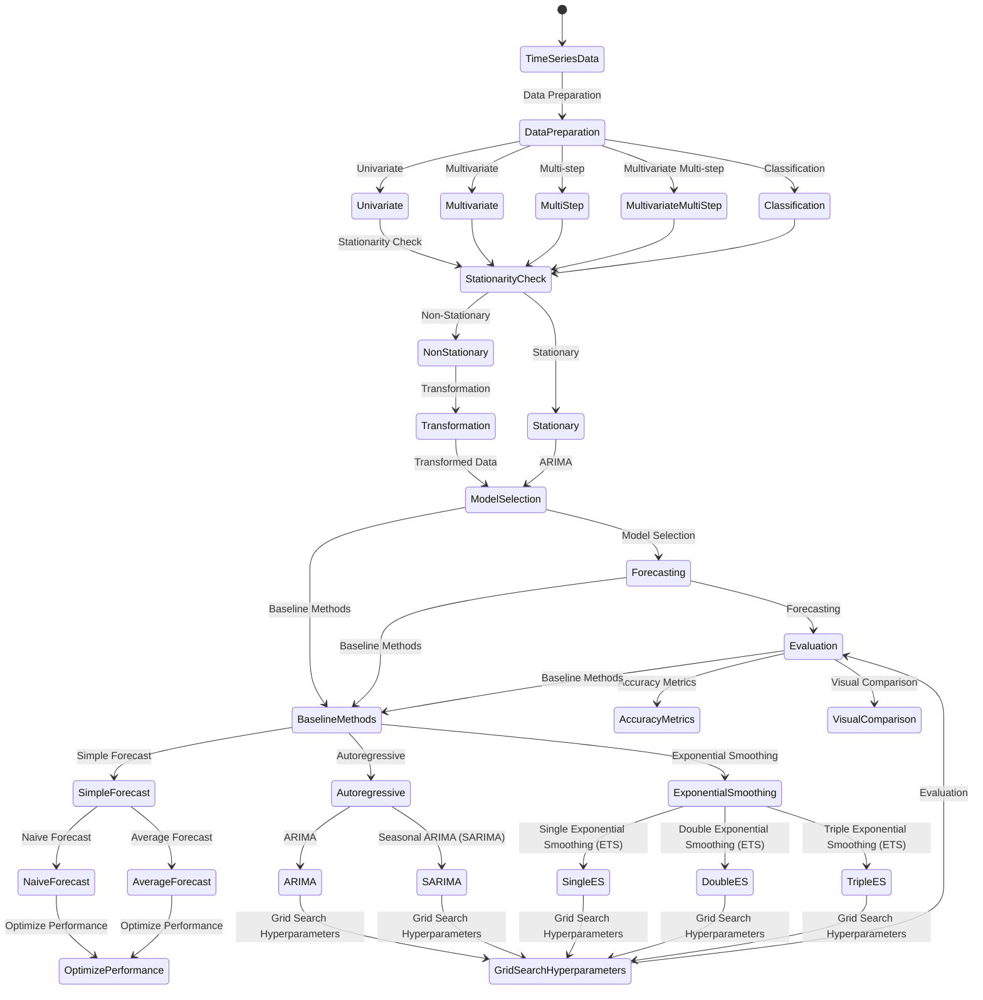

  <h1 align=center>14T-Machine-Learning-Time-Series-Projects-with-Python</h1>
  

<h2>Introduction to Time Series Forecasting</h2>

<strong>Time Series data:</strong> is a series of data points or observations recorded at different or regular time intervals. In general, a time series is a sequence of data points taken at equally spaced time intervals. The frequency of recorded data points may be hourly, daily, weekly, monthly, quarterly or annually. The time series data may be of three types:

<ol>
  <li>Time Series data: The observations of the values of a variable recorded at different points in time is called time series data.</li>
  <li>Cross Sectional data: It is the data of one or more variables recorded at the same point in time.</li>
  <li>Pooled data: It is the combination of time series data and cross sectional data.</li>
</ol>

<strong>Time-Series Analysis:</strong> encompasses statistical methods for analyzing time series data. These methods enable us to extract meaningful statistics, patterns and other characteristics of the data. Time series are visualized with the help of line charts. So, time series analysis involves understanding inherent aspects of the time series data so that we can create meaningful and accurate forecasts.

<strong>Time-Series Forecasting:</strong> is the process of <b>predicting future values</b> based on <b>historical patterns and trends in sequential data</b>.

<h3>Forecasting Problems</h3>

We will work through 5 different types of time series forecasting problems:

<ol>
  <li>Univariate: A single series of observations over time.</li>
  <li>Multivariate: Multiple inter-related observations over time.</li>
  <li>Multi-step: Forecast multiple time steps into the future.</li>
  <li>Multivariate Multi-step: Forecast multiple time steps into the future for multiple different series.</li>
  <li>Classification: Predict a discrete class given a sequence of observations over time.</li>
</ol>

<h3>Baseline Methods</h3>

We will discover 3 methods that you can use to develop robust baselines for your time series forecasting problems:

<ol>
  <li>Simple forecast methods: Methods such as naive or persistence forecasting and averaging methods, as well as how to optimize their performance.</li>
  <li>Autoregressive forecasting methods: Methods such as ARIMA and Seasonal ARIMA (SARIMA) and how to grid search their hyperparameters.</li>
  <li>Exponential smoothing forecasting methods: Methods such single, double and triple exponential smoothing also called ETS and how to grid search their hyperparameters.</li>
</ol>

<h3>Components of a Time Series</h3>

Time series data often exhibit patterns such as trends and seasonality. A typical time series can be decomposed into the following components:

<pre>"base level" + "trend" + "seasonality" (or "cyclic" behavior) + "error"</pre>
<ol>
  <li>Trend: represents a long-term overall pattern observed in the data. A trend can be increasing(upward), decreasing(downward), or horizontal(stationary).</li>
  <li>Seasonality: refers to a repetitive pattern that occurs at regular intervals, which could be daily, weekly, monthly, or any other fixed time period.</li>
  <li>Cyclical Component: Forecast multiple time steps into the future.</li>
  <li>Irregular Variation: Forecast multiple time steps into the future for multiple different series.</li>
  <li>ETS Decompositio: Predict a discrete class given a sequence of observations over time.</li>
</ol>

By understanding these components, we can develop models to capture and forecast the underlying patterns in the data.

<h3>Additive and Multiplicative Time Series</h3>

We may have different combinations of trends and seasonality. Depending on the nature of the trends and seasonality, a time series can be modeled as an additive or multiplicative time series. Wherein, each observation in the series can be expressed as either a sum or a product of the components:

Additive time series:

<ul>
  <li>Value = Base Level + Trend + Seasonality + Error</li>
</ul>

Multiplicative Time Series:

<ul>
  <li>Value = Base Level x Trend x Seasonality x Error</li>
</ul>

<h2>Time Series terminology</h2>

There are various terms and concepts in time series that we should know. These are as follows:

<ol>
  <li>Dependence: refers to the association of two observations of the same variable at prior time periods.</li>
  <li>Stationarity: shows the mean value of the series that remains constant over the time period. If past effects accumulate and the values increase towards infinity then stationarity is not met.</li>
  <li>Differencing: is used to make the series stationary and to control the auto-correlations. There may be some cases in time series analyses where we do not require differencing and over-differenced series can produce wrong estimates.</li>
  <li>Specification: may involve the testing of the linear or non-linear relationships of dependent variables by using time series models such as ARIMA models.</li>
  <li>Exponential Smoothing: in time series analysis predicts the one next period value based on the past and current value.  It involves averaging of data such that the non-systematic components of each individual case or observation cancel out each other.  The exponential smoothing method is used to predict the short term prediction.</li>
  <li>Curve fitting: regression in time series analysis is used when data is in a non-linear relationship.</li>
</ol>

<h3>Decomposition of a Time Series</h3>

Decomposition of a time series can be performed by considering the series as an additive or multiplicative combination of the base level, trend, seasonal index and the residual term. The seasonal_decompose in statsmodels implements this conveniently.

<h2>Stationary and Non-Stationary Time Series and Augmented Dickey-Fuller Test</h2>

Stationarity is an important concept in time series analysis. A stationary time series is one whose statistical properties, such as mean and variance, do not change over time. Stationary data is desirable for time series forecasting as it allows for more reliable modeling and prediction.

The Augmented Dickey-Fuller (ADF) test is a statistical test commonly used to determine if a time series is stationary. It examines the presence of unit roots, which are indicative of "non-stationarity". The null hypothesis of the ADF test is that the time series has a unit root, meaning it is "non-stationary". The alternate hypothesis is that the time series is "stationary". 
    

The ADF test evaluates the test statistic (usually denoted as Dickey-Fuller t-statistic) against critical values at different confidence levels. If the test statistic is less than the critical value, we reject the null hypothesis and conclude that the time series is "stationary". Conversely, if the test statistic is greater than the critical value, we fail to reject the null hypothesis and infer that the time series is "non-stationary".

The ADF test takes into account the autoregressive structure of the time series and helps identify the order of differencing required to achieve stationarity. Differencing involves computing the differences between consecutive observations, which can remove trends and make the series stationary.

Here are the steps to perform the ADF test:

<pre><b>Ho : Data is not Stationary   : NULL hypothesies</b></pre>

<pre><b>H1 : Data is Stationary       : alternate hypothesies</b></pre>

<ol>
  <li>In Python, you can use the `statsmodels.tsa.stattools` module.</li>
  <li>Apply the ADF test using the `adfuller()` function on your time series data.</li>
  <li>Retrieve the test statistic and p-value from the test result.</li>
  <li>Interpret the results:
    <ul>
      <li>If the p-value is less than a chosen significance level (e.g., 0.05), reject the null hypothesis and consider the time series "stationary".</li>
      <li>If the p-value is greater than the significance level, fail to reject the null hypothesis, indicating "non-stationarity".</li>
    </ul>
  </li>
  <li>Make necessary adjustments to achieve stationarity. This may involve differencing the data or applying other transformations.</li>
</ol>

By following these steps, you can assess the stationarity of your time series using the Augmented Dickey-Fuller test and take appropriate actions for modeling and forecasting.

<h3>Making data stationary with Differencing</h3>

Differencing is a technique used to make a time series stationary by calculating the differences between consecutive observations. It helps remove trends and other non-stationary components from the data, making it easier to analyze and model. Differencing is a common step in time series analysis and forecasting.

<h2>Time Series Forecasting Basics</h2>

  

Time series analysis often involves using ARMA (Autoregressive Moving Average) models. The general formula for an ARMA model is:

<pre><b>Yt = c + Σ(AR term ) + Σ(MA term ) + εt</b></pre>

<pre><b>Yt = c + Σ(ϕi * Yt-i) + Σ(θi * εt-i) + εt</b></pre>

Where:

<ul>
  <li>Yt represents the value of the time series at time t.</li>
  <li>c is a constant term or intercept.</li>
  <li>ϕi represents the autoregressive (AR) parameters, which capture the relationship between the current observation and previous observations Yt-i. The index i ranges from 1 to p, where p is the order of the autoregressive component.</li>
  <li>εt is the error term at time t, representing the deviation between the predicted and actual values.</li>
  <li>θi represents the moving average (MA) parameters, which capture the relationship between the error terms εt-i. The index i ranges from 1 to q, where q is the order of the moving average component.</li>
</ul>

<h2>What are AR and MA models?</h2>

ARMA models combine the autoregressive (AR) and moving average (MA) components to describe the dependence between the current observation and previous observations, as well as the dependence between the error terms. The autoregressive component considers the linear relationship between the current observation and a certain number of lagged observations. The moving average component models the linear dependence between the error terms and lagged error terms.

<h2>Introduction to ARIMA(p, d, q) Models</h2>

ARIMA (Autoregressive Integrated Moving Average) models extend the ARMA framework by incorporating differencing to achieve stationarity. Differencing involves subtracting the current observation from a lagged observation to remove the trend or seasonality present in the data. The order of differencing, denoted as d, indicates the number of times differencing is applied to the time series.

<h2>What does the p, d, and q in ARIMA model mean?</h2>

In ARIMA(p, d, q) models:

<ul>
  <li>p represents the order of the autoregressive (AR) component, indicating how many lagged observations are used for prediction.</li>
  <li>d represents the order of differencing, determining the number of times differencing is applied to achieve stationarity.</li>
  <li>q represents the order of the moving average (MA) component, indicating how many previous errors are considered for prediction.</li>
</ul>

<h2>How to find (p, d, q) for ARIMA(p, d, q) Models</h2>

Finding the appropriate values for p, d, and q requires analysis and experimentation:

<ul>
  <li>To determine the order of the autoregressive (AR) term (p), the partial autocorrelation function (PACF) plot can be used.</li>
  <li>To determine the order of the moving average (MA) term (q), the autocorrelation function (ACF) plot can be examined.</li>
  <li>To find the order of differencing (d) in the ARIMA model, the time series can be differenced multiple times until it becomes stationary. The differencing order can be determined by observing the plot or using statistical tests.</li>
</ul>

In addition to the non-seasonal components, ARIMA models can capture seasonality and incorporate exogenous variables using the SARIMAX model.

<h2>Introduction to SARIMAX(p, d, q)(P, D, Q, s) Models</h2>

SARIMAX models extend the ARIMA framework to incorporate seasonality and exogenous variables. In addition to the parameters of the ARIMA model, SARIMAX introduces additional sets of parameters:

<ul>
  <li>P represents the seasonal autoregressive (SAR) component.</li>
  <li>D represents the order of seasonal differencing.</li>
  <li>Q represents the seasonal moving average (SMA) component.</li>
  <li>s represents the length of the seasonal cycle.</li>
</ul>

SARIMAX models are particularly useful when dealing with time series data that exhibit seasonality. By including the seasonal component, the model can capture and account for recurring patterns.

Moreover, SARIMAX allows for the inclusion of exogenous variables, denoted as X, which can influence the time series being analyzed. By incorporating these variables, the model can account for their impact and provide more accurate forecasts.

Estimating the parameters of ARMA, ARIMA, and SARIMAX models involves techniques such as maximum likelihood estimation. The appropriate orders (p, d, q, P, Q) can be determined by analyzing plots such as the partial autocorrelation function (pacf) and autocorrelation function (acf) for both the seasonal and non-seasonal components.

These models offer a flexible framework for modeling and forecasting time series data, considering both the seasonal patterns and the influence of exogenous factors. They are widely used in various fields, including economics, finance, and demand forecasting, where seasonality and exogenous variables play crucial roles in accurate predictions.

<h2>Time Series Forecasting General Framework</h2>

Below steps provide a general framework, and the specific implementation may vary depending on the deep learning library or framework you are using. It's also essential to keep in mind the specific characteristics and requirements of your time series data when applying these steps.

<h3>1. Data Preparation:</h3>

This step involves gathering and cleaning your time series data. Ensure that your data is in a tabular format with a single column representing the target variable (output) and additional columns representing the input features. If you have a univariate time series, you need to create lagged versions of the variable to use as input features.

<ul>
  <li>Trend: Analyze the overall trend in the data (e.g., increasing, decreasing, or stationary). Use methods like trend decomposition or moving averages to identify and remove trends.</li>
  <li>Seasonality: Identify any repeating patterns or seasonal fluctuations in the data. Techniques like seasonal decomposition of time series (e.g., using STL decomposition) or Fourier transforms can help in detecting and extracting seasonal components.</li>
  <li>Stationarity: Check if the data is stationary (constant mean and variance) or requires transformation. Stationarity is essential for many time series models. Techniques like differencing or logarithmic transformation can be applied to achieve stationarity.</li>
</ul>

<h3>2. Normalization:</h3>

Normalize your input features to a similar scale. Deep learning models often benefit from scaled data, as it helps in faster convergence and better model performance. Common scaling techniques include min-max scaling or standardization.

<h3>3. Train-Test Split:</h3>

Split your dataset into training and testing subsets. Typically, you reserve a portion of the data (e.g., the most recent observations) for testing the model's performance. The remaining data will be used for training the model.

<h3>4. Reshaping:</h3>

Deep learning models expect input data in a specific shape, typically a three-dimensional structure of samples, timesteps, and features. Reshape your input data accordingly. For example, if you have N samples, T timesteps, and F features, your input shape would be (N, T, F).

<h3>5. Model Selection:</h3>
<ul>
  <li>Autoregressive Integrated Moving Average (ARIMA): A widely used model for time series forecasting. ARIMA models incorporate autoregressive (AR), differencing (I), and moving average (MA) components. Suitable for stationary time series with no trend or seasonality.</li>
  <li>Seasonal ARIMA (SARIMA): An extension of ARIMA that incorporates seasonal components in the data. It includes additional seasonal parameters to capture seasonal patterns.</li>
  <li>Exponential Smoothing (ES): Models the trend and seasonality using exponential decay. Various types of exponential smoothing methods, such as Simple Exponential Smoothing (SES), Holt's Linear Exponential Smoothing, or Holt-Winters' Triple Exponential Smoothing, can be employed.</li>
  <li>Prophet: Facebook's open-source library for time series forecasting. Prophet automates the process of forecasting by automatically detecting trend, seasonality, and holiday effects.</li>
  <li>Long Short-Term Memory (LSTM): A type of recurrent neural network that can capture long-term dependencies in the data. LSTM is effective for complex time series patterns and can handle sequences with varying lengths.</li>
</ul>

<h3>6. Model Architecture:</h3>

Design the architecture of your deep learning model. There are various architectures you can explore, such as Multilayer Perceptrons (MLPs), Convolutional Neural Networks (CNNs), Long Short-Term Memory networks (LSTMs), or hybrid models combining different architectures. Choose the architecture that best suits your problem and dataset.

<h3>7. Hyperparameter Tuning:</h3>

Select appropriate hyperparameters for your model. Hyperparameters include the number of layers, units per layer, activation functions, learning rate, batch size, etc. You can use techniques like grid search, random search, or Bayesian optimization to find the optimal combination of hyperparameters.

<h3>8. Model Training:</h3>

Train your deep learning model using the training data. This involves optimizing the model's weights using an optimization algorithm (e.g., stochastic gradient descent) and minimizing a loss function (e.g., mean squared error). Iterate over multiple epochs (passes through the training data) to improve the model's performance.

<h3>9. Model Evaluation:</h3>

Evaluate the trained model's performance on the test dataset. Calculate appropriate evaluation metrics such as mean squared error, mean absolute error, or accuracy, depending on the nature of your forecasting problem.

<ul>
  <li>Train-Test Split: Divide the data into training and testing sets, with earlier data for training and later data for testing.</li>
  <li>Evaluation Metrics: Calculate metrics such as Mean Squared Error (MSE), Mean Absolute Error (MAE), Root Mean Squared Error (RMSE), or Mean Absolute Percentage Error (MAPE) to assess forecast accuracy. Additionally, visual inspection of the forecasted values compared to the actual data can provide insights.</li>
</ul>

<h3>10. Prediction:</h3>

Once you have a trained and evaluated model, you can make predictions on new, unseen data. Prepare the new data in the same format as your training data (including normalization and reshaping) and use the trained model to forecast future values.

<h3>11. Model Refinement:</h3>

Analyze the model's performance and iteratively refine it. This may involve adjusting hyperparameters, trying different architectures, or incorporating additional features. Continuously evaluate and compare the model's performance with different variations to identify the best approach.

<h1>QnA Question and Answer:</h1>

<h2>Q: Up until now, we have <strong>observed similarities</strong> to identify the pattern. Now, how can <strong>any deviations</strong> from the norm be detected?</h2>

A: Indeed, one way to detect deviations from the normal pattern is through the <strong>decomposition of a time series</strong>. By decomposing a time series into its underlying components, such as trend, seasonality, and residual (or error), it becomes easier to identify any anomalous behavior or outliers that deviate from the expected pattern. The decomposition process allows us to analyze and understand the individual components of the time series, enabling us to detect any unusual variations or deviations from the norm.

<h2>Q: Reasons to convert a non-stationary series into a stationary one before forecasting?</h2>

Forecasting a stationary series is relatively easy and the forecasts are more reliable.

An important reason is that autoregressive forecasting models are essentially linear regression models that utilize the lag(s) of the series itself as predictors.

We know that linear regression works best if the predictors (X variables) are not correlated with each other. So, stationarizing the series solves this problem since it removes any persistent autocorrelation, thereby making the predictors (lags of the series) in the forecasting models nearly independent.

<h2>Q: Difference between White Noise and a Stationary series?</h2>

Like a stationary series, white noise is also not a function of time. So, its mean and variance do not change over time. But the difference is that white noise is completely random with a mean of 0. In white noise, there is no pattern.

Mathematically, a sequence of completely random numbers with mean zero is a white noise.

<h2>Q: How to test for stationarity?</h2>

<h3>Augmented Dickey–Fuller Test (ADF Test)</h3>
<ul>
  <li>Augmented Dickey Fuller test or (ADF Test) is the most commonly used test to detect stationarity. Here, we assume that the null hypothesis is that the time series possesses a unit root and is non-stationary. Then, we collect evidence to support or reject the null hypothesis. So, if we find that the p-value in the ADF test is less than the significance level (0.05), we reject the null hypothesis.</li>
  <li>Feel free to check the following links to learn more about the ADF Test:</li>
  <ul>
    <li><a href="https://en.wikipedia.org/wiki/Augmented_Dickey%E2%80%93Fuller_test">Wikipedia - Augmented Dickey–Fuller Test</a></li>
    <li><a href="https://www.machinelearningplus.com/time-series/augmented-dickey-fuller-test/">Machine Learning Plus - Augmented Dickey–Fuller Test</a></li>
    <li><a href="https://machinelearningmastery.com/time-series-data-stationary-python/">Machine Learning Mastery - Augmented Dickey–Fuller Test</a></li>
    <li><a href="http://www.insightsbot.com/augmented-dickey-fuller-test-in-python/">Insightsbot - Augmented Dickey–Fuller Test</a></li>
    <li><a href="https://nwfsc-timeseries.github.io/atsa-labs/sec-boxjenkins-aug-dickey-fuller.html">NWFSCTimeseries - Augmented Dickey–Fuller Test</a></li>
    <li><a href="https://www.statisticshowto.com/adf-augmented-dickey-fuller-test/">Statistics How To - Augmented Dickey–Fuller Test</a></li>
  </ul>
</ul>

<h3>Kwiatkowski-Phillips-Schmidt-Shin – KPSS test (trend stationary)</h3>
<ul>
  <li>The KPSS test, on the other hand, is used to test for trend stationarity. The null hypothesis and the P-Value interpretation are just the opposite of the ADF test.</li>
  <li>Interested readers can learn more about the KPSS test from the following links:</li>
  <ul>
    <li><a href="https://en.wikipedia.org/wiki/KPSS_test">Wikipedia - KPSS test</a></li>
    <li><a href="https://www.machinelearningplus.com/time-series/kpss-test-for-stationarity/">Machine Learning Plus - KPSS test for Stationarity</a></li>
    <li><a href="https://www.statisticshowto.com/kpss-test/">Statistics How To - KPSS test</a></li>
    <li><a href="https://nwfsc-timeseries.github.io/atsa-labs/sec-boxjenkins-kpss.html">NWFSCTimeseries - KPSS test</a></li>
  </ul>
</ul>

<h3>Philips Perron test (PP Test)</h3>
<ul>
  <li>The Philips Perron or PP test is a <a href="https://en.wikipedia.org/wiki/Unit_root">unit root test</a>. It is used in the <a href="https://en.wikipedia.org/wiki/Time_series">time series analysis</a> to test the <a href="https://en.wikipedia.org/wiki/Null_hypothesis">null hypothesis</a> that a time series is integrated of order 1. It is built on the ADF test discussed above.</li>
  <li>For more information on the PP test, please visit the following links:</li>
  <ul>
    <li><a href="https://en.wikipedia.org/wiki/Phillips%E2%80%93Perron_test">Wikipedia - Philips Perron Test</a></li>
    <li><a href="https://www.mathworks.com/help/econ/pptest.html">MathWorks - Philips Perron Test</a></li>
    <li><a href="https://people.bath.ac.uk/hssjrh/Phillips%20Perron.pdf">University of Bath - Philips Perron Test</a></li>
    <li><a href="https://www.stata.com/manuals13/tspperron.pdf">Stata - Philips Perron Test</a></li>
  </ul>
</ul>

<h2>Q: How to handle if a time series is slightly under or over-differenced?</h2>

If a time series is slightly underdifferenced, it means that further differencing is required to achieve stationarity. In this case, you can increase the order of differencing (d) in the ARIMA model until the series becomes stationary.

On the other hand, if a time series is slightly overdifferenced, it means that too much differencing has been applied, leading to an overly stationary series. In this situation, you can decrease the order of differencing (d) to achieve a better fit and improve the model's forecasting accuracy.

It is important to note that finding the right order of differencing can be a trial-and-error process. It is recommended to evaluate the model's performance using various orders of differencing and select the one that yields the best results based on evaluation metrics and the visual inspection of residual patterns.

<h2>Q: Detrend a Time Series</h2>

Detrending a time series means to remove the trend component from the time series. There are multiple approaches of doing this as listed below:

<ol>
  <li>Subtract the line of best fit from the time series. The line of best fit may be obtained from a linear regression model with the time steps as the predictor. For more complex trends, we may want to use quadratic terms (x^2) in the model.</li>
  <li>We subtract the trend component obtained from time series decomposition.</li>
  <li>Subtract the mean.</li>
  <li>Apply a filter like Baxter-King filter (statsmodels.tsa.filters.bkfilter) or the Hodrick-Prescott Filter (statsmodels.tsa.filters.hpfilter) to remove the moving average trend lines or the cyclical components.</li>
</ol>

Now, we will implement the first two methods to detrend a time series.

<h2>Q: Deseasonalize a Time Series</h2>

There are multiple approaches to deseasonalize a time series. These approaches are listed below:

<ol>
  <li>Take a moving average with length as the seasonal window. This will smoothen in series in the process.</li>
  <li>Seasonal difference the series (subtract the value of previous season from the current value).</li>
  <li>Divide the series by the seasonal index obtained from STL decomposition.</li>
</ol>

If dividing by the seasonal index does not work well, we will take a log of the series and then do the deseasonalizing. We will later restore to the original scale by taking an exponential.

<h2>Q: How to test for seasonality of a time series?</h2>

The common way to test for seasonality of a time series is to plot the series and check for repeatable patterns in fixed time intervals. So, the types of seasonality is determined by the clock or the calendar.

<ol>
  <li>Hour of day</li>
  <li>Day of month</li>
  <li>Weekly</li>
  <li>Monthly</li>
  <li>Yearly</li>
</ol>

However, if we want a more definitive inspection of the seasonality, use the <strong>Autocorrelation Function (ACF) plot</strong>. There is a strong seasonal pattern, the ACF plot usually reveals definitive repeated spikes at the multiples of the seasonal window.

<h2>Q: Autocorrelation and Partial Autocorrelation Functions</h2>

<strong>Autocorrelation</strong> is simply the correlation of a series with its own lags. If a series is significantly autocorrelated, that means, the previous values of the series (lags) may be helpful in predicting the current value.

<strong>Partial Autocorrelation</strong> also conveys similar information but it conveys the pure correlation of a series and its lag, excluding the correlation contributions from the intermediate lags.

<h2>Q: Computation of Partial Autocorrelation Function</h2>

The partial autocorrelation function of lag (k) of a series is the coefficient of that lag in the autoregression equation of Y. The autoregressive equation of Y is nothing but the linear regression of Y with its own lags as predictors.

For example, if <strong>Y_t</strong> is the current series and <strong>Y_t-1</strong> is the lag 1 of Y, then the partial autocorrelation of <strong>lag 3 (Y_t-3)</strong> is the coefficient α3 of Y_t-3 in the following equation:

<h2>Q: Lag Plots</h2>

A <strong>Lag plot</strong> is a scatter plot of a time series against a lag of itself. It is normally used to check for autocorrelation. If there is any pattern existing in the series, the series is autocorrelated. If there is no such pattern, the series is likely to be random white noise.

<h2>Q: Granger Causality Test</h2>

<strong>Granger causality test</strong> is used to determine if one time series will be useful to forecast another. It is based on the idea that if X causes Y, then the forecast of Y based on previous values of Y AND the previous values of X should outperform the forecast of Y based on previous values of Y alone.

So, <strong>Granger causality test</strong> should not be used to test if a lag of Y causes Y. Instead, it is generally used on exogenous (not Y lag) variables only. It is implemented in the statsmodel package.

It accepts a 2D array with 2 columns as the main argument. The values are in the first column and the predictor (X) is in the second column. The Null hypothesis is that the series in the second column does not Granger cause the series in the first. If the P-Values are less than a significance level (0.05), then we reject the null hypothesis and conclude that the said lag of X is indeed useful. The second argument maxlag says till how many lags of Y should be included in the test.

<h2>Q: Smoothening a Time Series</h2>

Smoothening of a time series may be useful in the following circumstances:

<ul>
  <li>Reducing the effect of noise in a signal to get a fair approximation of the noise-filtered series.</li>
  <li>The smoothed version of the series can be used as a feature to explain the original series itself.</li>
  <li>Visualize the underlying trend better.</li>
</ul>

We can smoothen a time series using the following methods:

<ul>
  <li>Take a moving average.</li>
  <li>Do a LOESS smoothing (Localized Regression).</li>
  <li>Do a LOWESS smoothing (Locally Weighted Regression).</li>
</ul>

<h2>Q: Moving Average</h2>

<strong>Moving average</strong> is the average of a rolling window of defined width. We must choose the window-width wisely because a large window-size will over-smooth the series. For example, a window-size equal to the seasonal duration (ex: 12 for a month-wise series) will effectively nullify the seasonal effect.

<h2>Q: Localized Regression</h2>

LOESS, short for ‘Localized Regression’, fits multiple regressions in the local neighborhood of each point. It is implemented in the statsmodels package, where you can control the degree of smoothing using the frac argument which specifies the percentage of data points nearby that should be considered to fit a regression model.

<h2>Time Series Analysis in Python</h2>

If you are interested in learning more about time series analysis in Python, you can explore the following resources:

<ul>
  <li><a href="https://www.statsmodels.org/stable/examples/index.html#time-series-analysis">StatsModels - Time Series Analysis Examples</a></li>
  <li><a href="https://www.simplilearn.com/tutorials/statistics-tutorial/p-value-in-statistics-hypothesis">Simplilearn - P-value in Statistics Hypothesis</a></li>
  <li><a href="https://www.machinelearningplus.com/time-series/time-series-analysis-python/">Machine Learning Plus - Time Series Analysis in Python</a></li>
  <li><a href="https://www.machinelearningplus.com/time-series/arima-model-time-series-forecasting-python/">Machine Learning Plus - ARIMA Model Time Series Forecasting in Python</a></li>
  <li><a href="https://machinelearningmastery.com/how-to-grid-search-triple-exponential-smoothing-for-time-series-forecasting-in-python/">Machine Learning Mastery - How to Grid Search Triple Exponential Smoothing for Time Series Forecasting in Python</a></li>
  <li><a href="https://machinelearningmastery.com/deep-learning-for-time-series-forecasting">Machine Learning Mastery - Deep Learning for Time Series Forecasting</a></li>
  <li><a href="https://www.sciencedirect.com/topics/earth-and-planetary-sciences/autoregressive-moving-average">ScienceDirect - Autoregressive Moving Average</a></li>
  <li><a href="https://towardsdatascience.com/an-end-to-end-project-on-time-series-analysis-and-forecasting-with-python-4835e6bf050b">Towards Data Science - An End-to-End Project on Time Series Analysis and Forecasting with Python</a></li>
</ul>
